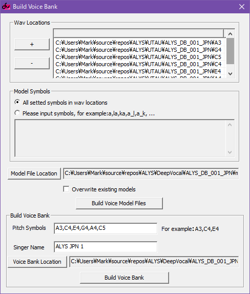
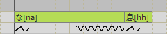
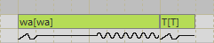

Thanks to VOISTAR Project's support, this DeepVocal voicebank was configured by Adlez27 based on ALYS_DB_001_JPN.

# Installation
Scroll down and download the file `ALYS_JPN_1.zip`. Unzip the file, then move the resulting `ALYS JPN 1` folder to `C:\Program Files (x86)\DeepVocal\singers`.

# Compiling from source
This is a completely OPTIONAL choice for those who want to modify the voicebank instead of using the precompiled version.

Clone this git repository locally.  
Download and install [DeepVocal ToolBox](https://deep-vocal.com/#/Product).  

Navigate to `ALYS\DeepVocal\ALYS_DB_001_JPN` and open `jpn1.dvtb` using DeepVocal ToolBox.  
Go to Function > Build Voice Bank. 

<!-- TODO: update screenshot -->


In Wav Locations, ensure all six sample folders have been added.

In Model Symbols, select "All setted symbols in wav locations". Create a new folder for model files and select it with the "Model File Location" button, then press "Build Voice Model Files".

In Build Voice Bank, ensure that all three pitches and the singer name has been specified. Use the "Voice Bank Location" button to select the `ALYS\DeepVocal\ALYS_DB_001_JPN\build` folder, then press Build Voice Bank.

The build folder can then be moved to `C:\Program Files (x86)\DeepVocal\singers` to use the voicebank in DeepVocal.

# Usage
A dictionary file has been included for compatibility with both romaji and hiragana lyrics.

## Multipitch
There are three full pitches (C4 E4 A4) and three additional vowel-only pitches (A3 G4 C5). It's recommended to cut long notes into a small starting note and long vowel note in order to make use of all six pitches.

## Extra phonemes
Besides standard Japanese syllables, the following extra syllables have been included in this voicebank.

| Consonant | IPA | Romaji | Hiragana | Romaji | Hiragana | Romaji | Hiragana | Romaji | Hiragana | Romaji | Hiragana |
| - | - | - | - | - | - | - | - | - | - | - | - |
| ky | kʲ |  |  |  |  |  |  | kye | きぇ |  |  |
| kw | kʷ | kwa | くぁ | kwi | くぃ |  |  | kwe | くぇ | kwo | くぉ |
| gy | ɡʲ |  |  |  |  |  |  | gye | ぎぇ |  |  |
| gw | ɡʷ | gwa | ぐぁ | gwi | ぐぃ |  |  | gwe | ぐぇ | gwo | ぐぉ |
| s | s |  |  | si | すぃ |  |  |  |  |  |  |
| sh | ʃ |  |  |  |  |  |  | she | しぇ |  |  |
| z | z |  |  | zi | ずぃ |  |  |  |  |  |  |
| j | d͡ʒ |  |  |  |  |  |  | je | じぇ |  |  |
| zh | ʒ | zha | ジャ | zhi | ジ | zhu | ジュ | zhe | ジェ | zho | ジョ |
| t | t |  |  | ti | てぃ | tu | とぅ |  |  |  |  |
| ty | tʲ | tya | てゃ |  |  | tyu | てゅ | tye | てぇ | tyo | てょ |
| ch | t͡ʃ |  |  |  |  |  |  | che | ちぇ |  |  |
| ts | t͡s | tsa | つぁ | tsi | つぃ |  |  | tse | つぇ | tso | つぉ |
| d | d |  |  | di | でぃ | du | どぅ |  |  |  |  |
| dy | dʲ | dya | でゃ |  |  | dyu | でゅ | dye | でぇ | dyo | でょ |
| dz | d͡z | dza | づぁ | dzi | づぃ | dzu | づ | dze | づぇ | dzo | づぉ |
| ny | ɲ |  |  |  |  |  |  | nye | にぇ |  |  |
| h | h |  |  |  |  | hu | ほぅ |  |  |  |  |
| hy | ç |  |  |  |  |  |  | hye | ひぇ |  |  |
| f | ɸ | fa | ふぁ | fi | ふぃ |  |  | fe | ふぇ | fo | ふぉ |
| fy | ɸʲ | fya | ふゃ |  |  | fyu | ふゅ | fye | ふぃぇ | fyo | ふょ |
| by | bʲ |  |  |  |  |  |  | bye | びぇ |  |  |
| py | pʲ |  |  |  |  |  |  | pye | ぴぇ |  |  |
| my | mʲ |  |  |  |  |  |  | mye | みぇ |  |  |
| y | j |  |  | yi | いぃ |  |  | ye | いぇ |  |  |
| ry | ɾʲ |  |  |  |  |  |  | rye | りぇ |  |  |
| l | l | la | ラ | li | リ | lu | ル | le | レ | lo | ロ |
| w | w |  |  | wi | うぃ | wu | うぅ | we | うぇ | wo | うぉ |

## Variant ん
There are 4 different pronunciations of ん available for different contexts. You must manually specify which variation to use in note lyrics.

| Romaji | Hiragana | Context |
|-|-|-|
| nny | んny | Before ny |
| mm | んm | Before b, by, p, py, m, my |
| ng | んng | Before k, ky, kw, g, gy, gw |
| nn | ん | Everywhere else |

## End breaths
Create a note at the end of a note with the lyric `hh` or `息` for an exhale.



## Ending consonants
Similar to end breaths, you can put a single consonant at the end of a note, written in all caps. You cannot use consonants as isolated notes, or as consonant clusters. The following consonants can be used.



```
K KY KW G GY GW
S SH Z J ZH
T TY CH TS D DY DZ
N NY
H HY F FY B BY P PY
M MY
Y
R RY L
W
```