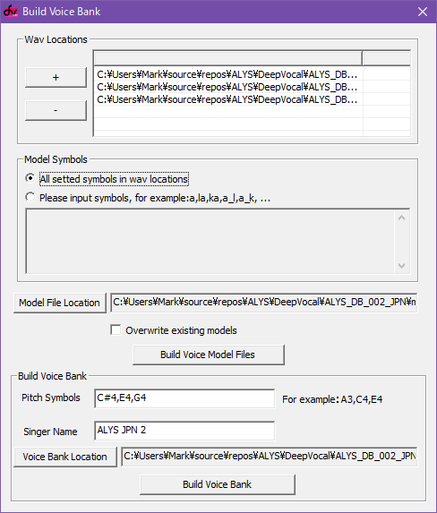

This DeepVocal voicebank was configured by Adlez27 based on ALYS_DB_002_JPN. 

# Installation
Scroll down and download the file `ALYS JPN 2.zip`. Unzip the file, then move the resulting `ALYS JPN 2` folder to `C:\Program Files (x86)\DeepVocal\singers`.
# Compiling from source
This is a completely OPTIONAL choice for those who want to modify the voicebank instead of using the precompiled version.

Clone this git repository locally.  
Download and install [DeepVocal ToolBox](https://deep-vocal.com/#/Product).  

Navigate to `ALYS\DeepVocal\ALYS_DB_002_JPN` and open `jpn2.dvtb` using DeepVocal ToolBox.  
Go to Function > Build Voice Bank. 



In Wav Locations, ensure all three sample folders have been added.

In Model Symbols, select "All setted symbols in wav locations". Create a new folder for model files and select it with the "Model File Location" button, then press "Build Voice Model Files".

In Build Voice Bank, ensure that all three pitches and the singer name has been specified. Use the "Voice Bank Location" button to select the `ALYS\DeepVocal\ALYS_DB_002_JPN\build` folder, then press Build Voice Bank.

The build folder can then be moved to `C:\Program Files (x86)\DeepVocal\singers` to use the voicebank in DeepVocal.

# Usage
A dictionary file has been included for compatibility with both romaji and hiragana lyrics.

Besides standard Japanese syllables, the following extra syllables have been included in this voicebank.

```
kye gye
si she zi je
ti tu che tsa tsi tse tso di du
nye
hu fa fi fe fo hye bye pye
mye
rye
ye
wi we
```

## Variant ん
There are 7 different pronunciations of ん available for different contexts. You must manually specify which variation to use in note lyrics.

| Romaji | Hiragana | Context |
|-|-|-|
| nn | んn | Before j, t, ts, d, n, r |
| nny | んny | Before ny, ry |
| mm | んm | Before b, p, m |
| mmy | んmy | Before by, py, my |
| nng | んng | Before k, g |
| nngy | んngy | Before ky, gy |
| N | ん | Everywhere else |

## Multipitch
Only the middle pitch (E4) is a true full voicebank, while the upper (G4) and lower (C#4) pitches are sustained vowels only. It's recommended to cut long notes into a small starting note and long vowel note in order to make use of all three pitches.